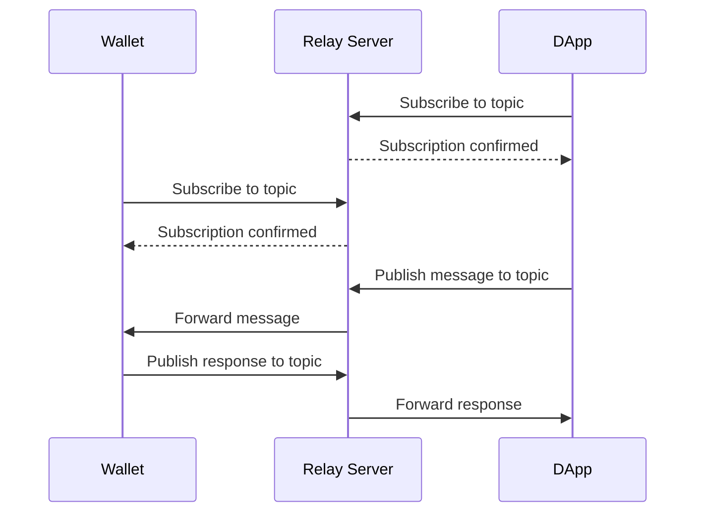
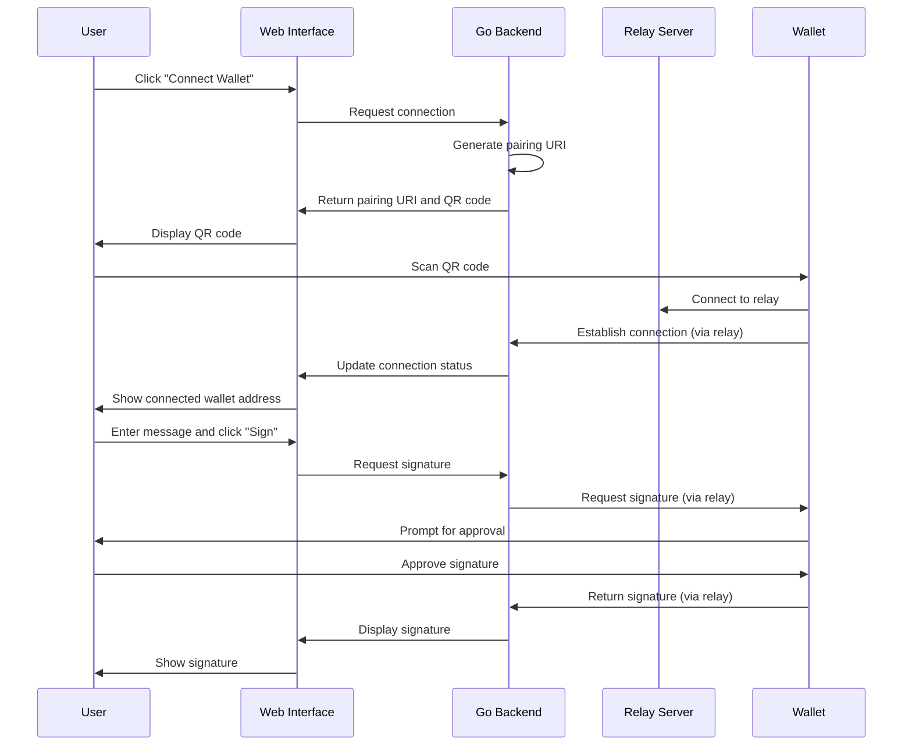

# Detailed Implementation Plan for WalletConnect Go Application

## 1. Project Structure

```
wctestapp/
├── cmd/
│   └── wctestapp/
│       └── main.go           # Application entry point
├── internal/
│   ├── config/
│   │   └── config.go         # Configuration handling
│   ├── relay/
│   │   ├── relay.go          # Relay server implementation
│   │   ├── subscription.go   # Subscription management
│   │   └── message.go        # Message handling
│   ├── wallet/
│   │   ├── wallet.go         # WalletConnect client implementation
│   │   ├── crypto.go         # Cryptographic functions
│   │   └── session.go        # Session management
│   └── server/
│       ├── server.go         # HTTP server
│       ├── handlers.go       # HTTP handlers
│       └── middleware.go     # HTTP middleware
├── web/
│   ├── static/
│   │   ├── css/
│   │   │   └── style.css     # Basic CSS
│   │   └── js/
│   │       └── main.js       # Client-side JavaScript
│   └── templates/
│       ├── index.html        # Main page template
│       ├── connected.html    # Connected wallet template
│       └── layout.html       # Layout template
├── pkg/
│   └── utils/
│       ├── qrcode.go         # QR code generation
│       └── crypto.go         # Shared cryptographic utilities
├── .github/
│   └── workflows/
│       ├── build.yml         # GitHub Actions build workflow
│       └── test.yml          # GitHub Actions test workflow
├── go.mod                    # Go module file
├── go.sum                    # Go dependencies checksum
├── README.md                 # Project documentation
└── Makefile                  # Build and development commands
```

## 2. Core Components

### 2.1 Simplified Relay Server



The relay server will:
1. Implement WebSocket connections for real-time communication
2. Manage topic subscriptions for message routing
3. Handle message relaying between dApp and wallet
4. Implement basic logging for educational purposes

#### Key Components:

- **WebSocket Server**: Handles client connections and maintains connection state
- **Topic Manager**: Manages subscriptions to topics and routes messages
- **Message Handler**: Processes incoming messages and forwards them to subscribers
- **Logger**: Provides detailed logging of all operations for educational purposes

#### Implementation Details:

- Use Go's standard `net/http` and `gorilla/websocket` for WebSocket implementation
- Implement a simple in-memory subscription registry
- Use channels for message passing between goroutines
- Implement detailed logging with context information

### 2.2 WalletConnect Client



The WalletConnect client will:
1. Generate pairing URIs for wallet connections
2. Establish secure connections with wallets via the relay server
3. Request message signatures from connected wallets
4. Verify and display signatures

#### Key Components:

- **Session Manager**: Handles WalletConnect sessions and their lifecycle
- **Pairing Handler**: Generates pairing URIs and QR codes
- **Crypto Module**: Handles encryption, decryption, and key management
- **Message Formatter**: Formats Ethereum signing requests

#### Implementation Details:

- Generate unique topics for pairing and sessions
- Implement ECDH key exchange for secure communication
- Format signing requests according to EIP-191/EIP-712
- Verify signatures using Ethereum's elliptic curve cryptography

### 2.3 Web Interface

The web interface will be simple and educational, with:
1. A "Connect Wallet" button that displays a QR code when clicked
2. Display of the connected wallet address
3. A text input field for entering messages to sign
4. A "Sign Message" button to request signatures
5. Display of the resulting signature
6. Detailed logs explaining the process

#### Key Pages:

- **Home Page**: Initial connection interface with "Connect Wallet" button
- **Connected Page**: Shows connected wallet and signing interface
- **Result Page**: Displays signature results

#### Implementation Details:

- Use Go's `html/template` for server-side rendering
- Implement minimal CSS for basic styling
- Use form submissions instead of AJAX for simplicity
- Include detailed process explanations in the UI

## 3. Implementation Phases

### Phase 1: Project Setup and Basic Structure (1-2 days)
1. Initialize Go module and project structure
   - Set up directory structure
   - Configure Go module
   - Create basic README
2. Set up HTTP server with basic routing
   - Implement server startup and shutdown
   - Create basic route handlers
   - Set up static file serving
3. Create HTML templates and static files
   - Design basic UI templates
   - Implement CSS styling
   - Create client-side JavaScript
4. Implement configuration handling
   - Create configuration structs
   - Implement environment variable loading
   - Set up default configurations

### Phase 2: Simplified Relay Server Implementation (2-3 days)
1. Implement WebSocket server
   - Set up WebSocket endpoint
   - Handle connection lifecycle
   - Implement ping/pong for connection health
2. Create topic subscription management
   - Implement subscription registry
   - Create subscribe/unsubscribe handlers
   - Develop topic validation
3. Develop message routing system
   - Create message queue
   - Implement message forwarding
   - Handle delivery acknowledgments
4. Add detailed logging for educational purposes
   - Implement structured logging
   - Add context information to logs
   - Create educational log messages

### Phase 3: WalletConnect Client Implementation (3-4 days)
1. Implement pairing URI generation
   - Create URI format according to spec
   - Generate unique topics
   - Implement QR code generation
2. Create session management
   - Implement session creation
   - Handle session updates
   - Manage session expiration
3. Develop cryptographic functions for secure communication
   - Implement key generation
   - Create encryption/decryption functions
   - Handle key exchange
4. Implement message signing requests
   - Format Ethereum signing requests
   - Handle signature responses
   - Verify signatures

### Phase 4: Web Interface Integration (2-3 days)
1. Create connection flow with QR code generation
   - Implement "Connect Wallet" button
   - Display QR code
   - Handle connection status updates
2. Implement wallet address display
   - Show connected wallet address
   - Display connection status
   - Handle disconnections
3. Develop message signing interface
   - Create message input form
   - Implement signing request submission
   - Display signature results
4. Add detailed process explanations in the UI
   - Create educational tooltips
   - Add process visualization
   - Implement detailed logging display

### Phase 5: Testing and Documentation (2-3 days)
1. Write unit tests for core components
   - Test relay server functionality
   - Validate cryptographic functions
   - Verify message handling
2. Create integration tests for the complete flow
   - Test end-to-end connection process
   - Validate signing workflow
   - Test error handling
3. Develop comprehensive README with setup and usage instructions
   - Write installation guide
   - Create usage documentation
   - Add troubleshooting section
4. Add detailed comments and logs throughout the codebase
   - Document complex functions
   - Explain protocol details
   - Add educational comments

## 4. Technical Details

### 4.1 WalletConnect v2.0 Protocol Implementation

The WalletConnect v2.0 protocol involves several key components:

1. **Pairing**: Establishing a connection between dApp and wallet
   - Generate a pairing URI with a unique topic
   - Display as QR code for wallet scanning
   - URI format: `wc:${topic}@${version}?relay-protocol=${protocol}&symKey=${symKey}`

2. **Session Establishment**:
   - Negotiate session parameters
   - Exchange public keys for encryption
   - Establish session topic for communication
   - Handle session metadata (app details, chains, methods)

3. **Message Signing**:
   - Format Ethereum signing requests (personal_sign, eth_signTypedData)
   - Send requests through the relay
   - Receive and verify signatures
   - Handle different signature types (EIP-191, EIP-712)

#### Protocol Flow:

1. **Pairing Creation**:
   - Generate random topic and symmetric key
   - Create pairing URI
   - Display QR code

2. **Pairing Approval**:
   - Wallet scans QR code
   - Wallet connects to relay server
   - Wallet subscribes to pairing topic

3. **Session Proposal**:
   - dApp proposes session with parameters
   - Wallet receives proposal via relay
   - User approves/rejects in wallet

4. **Session Creation**:
   - Exchange session parameters
   - Establish secure communication channel
   - Create session topic for future communication

5. **Message Signing**:
   - dApp formats signing request
   - Request sent via relay to wallet
   - User approves in wallet
   - Signature returned via relay

### 4.2 Simplified Relay Server

Our simplified relay server will implement:

1. **WebSocket Server**:
   - Handle client connections
   - Manage connection lifecycle
   - Implement heartbeat mechanism

2. **Topic Subscription**:
   - Allow clients to subscribe to topics
   - Maintain subscription registry
   - Handle subscription expiration

3. **Message Routing**:
   - Route messages between subscribers
   - Implement basic message queue
   - Handle delivery acknowledgments

4. **Logging**:
   - Detailed logs of all operations
   - Educational explanations of the relay process
   - Visualization of message flow

#### Simplified Protocol:

For educational purposes, our relay server will implement a simplified version of the WalletConnect relay protocol:

1. **Subscribe**: Client subscribes to a topic
   ```json
   {
     "id": 1,
     "jsonrpc": "2.0",
     "method": "subscribe",
     "params": {
       "topic": "topic_id"
     }
   }
   ```

2. **Publish**: Client publishes a message to a topic
   ```json
   {
     "id": 2,
     "jsonrpc": "2.0",
     "method": "publish",
     "params": {
       "topic": "topic_id",
       "message": "encrypted_message",
       "ttl": 86400
     }
   }
   ```

3. **Unsubscribe**: Client unsubscribes from a topic
   ```json
   {
     "id": 3,
     "jsonrpc": "2.0",
     "method": "unsubscribe",
     "params": {
       "topic": "topic_id"
     }
   }
   ```

### 4.3 Cryptography

The application will implement:

1. **Key Generation**:
   - Generate key pairs for secure communication
   - Create symmetric keys for encryption
   - Implement secure random number generation

2. **Encryption/Decryption**:
   - Encrypt messages between dApp and wallet
   - Decrypt incoming messages
   - Use AES-256-GCM for symmetric encryption

3. **Signature Verification**:
   - Verify Ethereum signatures
   - Display signature details
   - Support different signature types

#### Cryptographic Operations:

1. **Key Generation**:
   - Generate ECDH key pairs (secp256k1 curve)
   - Derive shared secrets using ECDH
   - Generate random symmetric keys

2. **Encryption**:
   - Use AES-256-GCM for symmetric encryption
   - Include IV and authentication tag
   - Encode encrypted data in base64

3. **Signature Verification**:
   - Recover Ethereum address from signature
   - Verify signature against message
   - Format messages according to EIP-191

## 5. GitHub Actions Workflows

### 5.1 Build Workflow
- Triggered on push to main and pull requests
- Builds the application for multiple platforms
- Runs linting and static analysis

```yaml
name: Build

on:
  push:
    branches: [ main ]
  pull_request:
    branches: [ main ]

jobs:
  build:
    runs-on: ubuntu-latest
    steps:
    - uses: actions/checkout@v3
    - name: Set up Go
      uses: actions/setup-go@v4
      with:
        go-version: '1.24'
    - name: Build
      run: go build -v ./...
    - name: Lint
      uses: golangci/golangci-lint-action@v3
      with:
        version: latest
```

### 5.2 Test Workflow
- Runs unit and integration tests
- Generates test coverage reports
- Validates documentation

```yaml
name: Test

on:
  push:
    branches: [ main ]
  pull_request:
    branches: [ main ]

jobs:
  test:
    runs-on: ubuntu-latest
    steps:
    - uses: actions/checkout@v3
    - name: Set up Go
      uses: actions/setup-go@v4
      with:
        go-version: '1.24'
    - name: Test
      run: go test -v -race -coverprofile=coverage.txt -covermode=atomic ./...
    - name: Upload coverage
      uses: codecov/codecov-action@v3
      with:
        file: ./coverage.txt
```

## 6. Educational Aspects

The application will include:

1. **Detailed Logging**:
   - Log all operations with explanations
   - Show message flow between components
   - Visualize the connection and signing process

2. **Process Visualization**:
   - Display the connection and signing process
   - Explain each step in the UI
   - Show encrypted vs. decrypted messages

3. **Code Comments**:
   - Comprehensive comments explaining implementation details
   - References to WalletConnect specifications
   - Educational explanations of cryptographic concepts

4. **README Documentation**:
   - Detailed explanation of WalletConnect protocol
   - Step-by-step usage instructions
   - Architecture overview
   - Troubleshooting guide

## 7. Dependencies

To minimize external dependencies, we'll primarily use:

1. **Go Standard Library**:
   - `net/http` for HTTP server
   - `crypto` packages for cryptographic operations
   - `encoding/json` for JSON handling
   - `html/template` for HTML templating

2. **Minimal External Dependencies**:
   - `github.com/gorilla/websocket` for WebSocket implementation
   - `github.com/skip2/go-qrcode` for QR code generation
   - `github.com/ethereum/go-ethereum/crypto` for Ethereum-specific cryptography

## 8. Challenges and Considerations

1. **Simplified vs. Standard Protocol**:
   - Our simplified relay may not be fully compatible with all wallets
   - Educational focus vs. production readiness
   - May need to implement mock wallet for testing

2. **Security Considerations**:
   - Proper key management
   - Secure communication channels
   - Protection against replay attacks

3. **Error Handling**:
   - Robust error handling for connection issues
   - User-friendly error messages
   - Graceful degradation

4. **Testing Without Real Wallets**:
   - Implementing mock wallets for testing
   - Validating protocol compliance
   - Simulating different wallet behaviors

## 9. Future Enhancements

Potential future enhancements beyond the initial implementation:

1. **Full Protocol Compliance**:
   - Implement complete WalletConnect v2.0 specification
   - Support all standard methods and events

2. **Multiple Chain Support**:
   - Add support for additional EVM-compatible chains
   - Implement chain switching

3. **Advanced Signing**:
   - Support for EIP-712 typed data signing
   - Transaction signing and sending

4. **Improved UI**:
   - Enhanced visualization of the connection process
   - Real-time status updates
   - Mobile-responsive design

5. **Performance Optimizations**:
   - Connection pooling
   - Message batching
   - Efficient subscription management